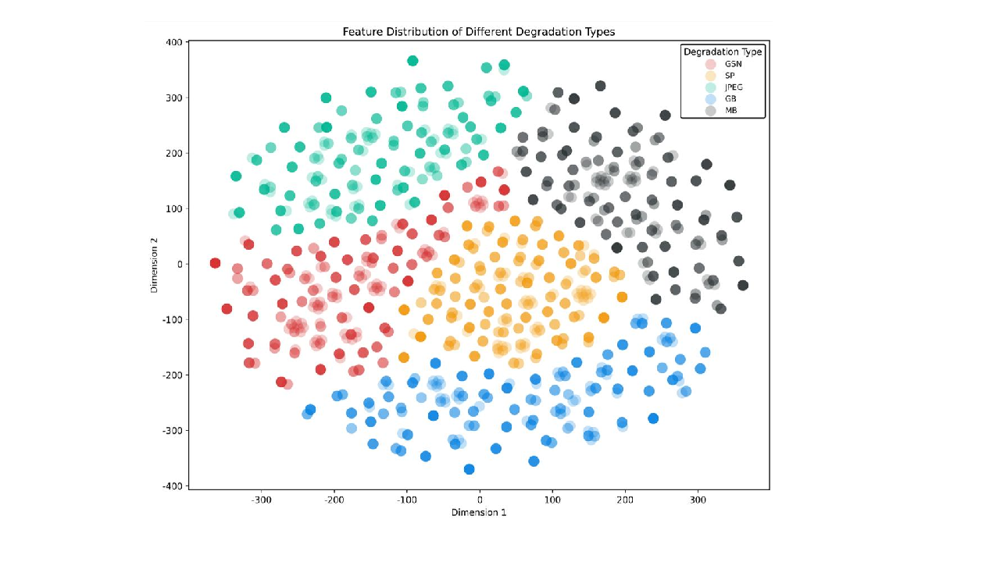

# Orthogonally Disentangled Mixture-of-Experts for Unified Image Restoration under Heterogeneous Degradations


<hr />

> **Abstract:** *Unified image restoration aims to recover high-quality images from multiple degradations within a shared model, which is important for practical deployment in complex real-world scenarios. However, existing methods often show unstable gains or even performance degradation as more heterogeneous degradation types are included in training, due to conflicting optimization demands in a shared parameter space. In this paper, we propose OMoE-Net, an orthogonally disentangled mixture-of-experts framework for unified image restoration under heterogeneous degradations. A shared experts branch and a degradation-specific expert branch are jointly introduced to model common restoration priors and degradation-related variations in a unified encoder-decoder architecture. Orthogonal regularization is applied to expert parameters to promote clearer expert specialization, and a degradation-aware path controller further selects Top-K experts while imposing orthogonal guidance on routed features to reduce representation overlap. Extensive experiments on multiple representative degradations demonstrate that OMoE-Net delivers better overall restoration performance and stronger robustness to increasing task diversity.* 
<hr />

## Network Architecture
 

## Installation and Data Preparation

See [INSTALL.md](INSTALL.md) for the installation of dependencies and dataset preperation required to run this codebase.

## Training

After preparing the training data in ```data/``` directory, use 
```
python train.py
```
to start the training of the model. Use the ```de_type``` argument to choose the combination of degradation types to train on. By default it is set to all the 5 degradation tasks (denoising, deraining, dehazing, deblurring, enhancement).

Example Usage: If we only want to train on deraining and dehazing:
```
python train.py --de_type derain dehaze
```

## Testing

After preparing the testing data in ```test/``` directory, place the mode checkpoint file in the ```ckpt``` directory. The pre-trained model can be downloaded [here](https://drive.google.com/drive/folders/1x2LN4kWkO3S65jJlH-1INUFiYt8KFzPH?usp=sharing). To perform the evaluation, use
```
python test.py --mode {n}
```
```n``` is a number that can be used to set the tasks to be evaluated on, 0 for denoising, 1 for deraining, 2 for dehazing, 3 for deblurring, 4 for enhancement, 5 for three-degradation all-in-one setting and 6 for five-degradation all-in-one setting.

Example Usage: To test on all the degradation types at once, run:

```
python test.py --mode 6
```
<!-- 
## Demo
To obtain visual results from the model ```demo.py``` can be used. After placing the saved model file in ```ckpt``` directory, run:
```
python demo.py --test_path {path_to_degraded_images} --output_path {save_images_here}
```
Example usage to run inference on a directory of images:
```
python demo.py --test_path './test/demo/' --output_path './output/demo/'
```
Example usage to run inference on an image directly:
```
python demo.py --test_path './test/demo/image.png' --output_path './output/demo/'
```
To use tiling option while running ```demo.py``` set ```--tile``` option to ```True```. The Tile size and Tile overlap parameters can be adjusted using ```--tile_size``` and ```--tile_overlap``` options respectively. -->


## Qualitative comparison results
 


## Visualization diagram of different degradation characteristics
 


